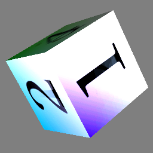
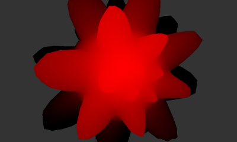

Introduction
=================

Project Etnaviv is an open source user-space driver for the Vivante GCxxx series of embedded GPUs.

A Mesa fork with the etnaviv driver can be found in the [laanwj/mesa](https://github.com/laanwj/mesa) repository. 
At the moment, this driver provides rudimentary OpenGL ES 2.0 accelerated rendering direct to framebuffer (fbdev).
OpenGL ES 1.0 should also work, but has not been tested much. There may still be quite a few rendering bugs, 
specific bug reports are very welcome.

SoCs with Vivante GPU
=========================

ARM-based:
- Marvell Armada 1500 has a GC1000: Google TV, OLPC
- Marvell Armada 510 has a GC600: [CuBox](http://www.solid-run.com/cubox)
- Rockchip 2918 has a GC800: some Arnova tablets
- Freescale i.MX6 Quad and Dual have a GC2000 + GC320 + GC355
- Freescale i.MX6 DualLite and Solo have a GC880 + GC320
- Freescale i.MX6 SoloLite has GC320 + GC355 (no 3D)
- Actions Semiconductor ATM7029 has a GC1000

MIPS-based:
- Ingenic JZ4770 has a GC860: [GCW Zero](http://www.gcw-zero.com)
- Ingenic JZ4760 has a GC200 (2D only)

See also [wikipedia](https://en.wikipedia.org/wiki/Vivante_Corporation).

For the Vivante GPUs on many platforms feature bits have been determined, these can be found in 
[doc/gpus_comparison.html](http://dev.visucore.com/etna_viv/gpus_comparison.html).

Compatibility
----------------

`etna_pipe` is currently compatible with at least the following GC chips:

- GC600 (CuBox/dove)
- GC800 (Rockchip/arnova)
- GC860 (GCW Zero/v2)
- GC880 (i.MX6)

Support for GC2000 (i.MX6) and others with multiple pixel pipes requires a few changes.

Building
=========

The build process is made more complicated by the existence of many different kernel drivers, with their subtly 
different interface (different headers, different offsets for fields, different management of context, and so on). 
These values for environment variable `GCABI` are supported out of the box:

- `dove`: Marvell Dove, newer drivers (0.8.0.3184)
- `dove_old`: Marvell Dove, older drivers (0.8.0.1998, 0.8.0.1123)
- `arnova`: Android, Arnova 10B G3 tablet (RK2918)
- `v2`: Various
- `v4`: Various, newer API than v2
- `imx6`: v4 API, specialized for i.MX6
- `imx6_v4_0_0`: v4 API, but i.MX6 specific, release 4.0.0

If possible get the `gc_*.h` headers for your specific kernel version. If that's not possible, try to find which of the above sets
of headers is most similar, and adapt that.

General
--------
If the goal is to build Mesa and you are not planning to do reverse engineering, only `libetnaviv.a` needs to be built.
In this case it is sufficient to run make in `native/etnaviv`.

Otherwise, run `make` and `make rev` in `native/` (see the README.md in `native` for a description of all the directories contained within).

`gc_abi.h`
-----------
`gc_abi.h` is an extra header that defines the following flags describing the kernel interface to etna, for a certain
setting of the environment variable `GCABI`:

- `GCABI_CONTEXT_HAS_PHYSICAL`: `struct _gcoCONTEXT` has `physical` and `bytes` fields
- `GCABI_HAS_MINOR_FEATURES_2`: `struct _gcsHAL_QUERY_CHIP_IDENTITY` has `chipMinorFeatures2` field
- `GCABI_HAS_MINOR_FEATURES_3`: `struct _gcsHAL_QUERY_CHIP_IDENTITY` has `chipMinorFeatures3` field
- `GCABI_USER_SIGNAL_HAS_TYPE`: `struct _gcsHAL_USER_SIGNAL` has `signalType` field
- `GCABI_HAS_CONTEXT`: `struct _gcsHAL_COMMIT` has `contextBuffer` field
- `GCABI_HAS_STATE_DELTAS`: `struct _gcsHAL_COMMIT` has `delta` field

It would be very useful to have an auto-detection of the Vivante kernel version, to prevent crashes and such from wrong
interfaces. However, I don't currently know any way to do this. The kernel does check the size of the passed ioctl structure, however
this guarantees nothing about the field offsets. There is `/proc/driver/gc` that in some cases contains a version number. In
very new drivers there is an ioctl call `gcvHAL_VERSION` that returns the major, minor and build version.

Linux cross compile
--------------------

For non-Android Linux ARM cross compile, create a script like this (example for CuBox) to set up the build environment. 
When command stream dumping the egl demos, don't forget to also copy the EGL/GLES2/KDR headers from 
some place and put them in a directory `include` under the location
where the script is installed, and get the `libEGL.so` and `libGLESv2.so` from the device into `lib`:

    DIR="$( cd "$( dirname "${BASH_SOURCE[0]}" )" && pwd )"
    export GCCPREFIX="arm-linux-gnueabi-"
    export PLATFORM_CFLAGS="-I${DIR}/include"
    export PLATFORM_CXXFLAGS="-I${DIR}/include"
    export PLATFORM_LDFLAGS="-ldl -L${DIR}/lib"
    export PLATFORM_GL_LIBS="-lEGL -lGLESv2 -L${TOP}/lib/egl -Xlinker --allow-shlib-undefined"
    # Set GC kernel ABI to dove (important!)
    #export GCABI="dove"      # 0.8.0.3184
    export GCABI="dove_old"  # 0.8.0.1998, 0.8.0.1123

If you haven't got the `arm-linux-gnueabi-` bintools, on an Debian/Ubuntu host they can be installed with

    apt-get install gcc-arm-linux-gnueabi g++-arm-linux-gnueabi

On ARM hardfloat targets you should use `gcc-arm-linux-gnueabihf-` instead.

Android cross compile
----------------------

To build for an Android device, install the Android NDK and define the cross-build environment by setting
environment variables, for example like this:

    export NDK="/opt/ndk"
    export TOOLCHAIN="/opt/ndk/toolchains/arm-linux-androideabi-4.6/prebuilt/linux-x86"
    export SYSROOT="/opt/ndk/platforms/android-14/arch-arm"
    export PATH="$PATH:$TOOLCHAIN/bin"

    export GCCPREFIX="arm-linux-androideabi-"
    export CXXABI="armeabi-v7a"
    export PLATFORM_CFLAGS="--sysroot=${SYSROOT} -DANDROID -DPIPE_ARCH_LITTLE_ENDIAN"
    export PLATFORM_CXXFLAGS="--sysroot=${SYSROOT} -DANDROID -DPIPE_ARCH_LITTLE_ENDIAN -I${NDK}/sources/cxx-stl/gnu-libstdc++/4.6/include -I${NDK}/sources/cxx-stl/gnu-libstdc++/4.6/libs/${CXXABI}/include"
    export PLATFORM_LDFLAGS="--sysroot=${SYSROOT} -L${NDK}/sources/cxx-stl/gnu-libstdc++/4.6/libs/${CXXABI} -lgnustl_static"
    # Set GC kernel ABI (important!)
    #export GCABI="v2"
    #export GCABI="v4"
    export GCABI="arnova"

To build the egl samples (for command stream interception), you need to copy `libEGL_VIVANTE.so` `libGLESv2_VIVANTE.so` from 
the device `/system/lib/egl` to `native/lib/egl`. This is not needed if you just want to build the `replay`, `etna` or `fb`
tests, which do not rely in any way on the userspace blob.

Contents
==========

The repository contains various tools and documentation related to figuring out how to 
program Vivante GCxxx GPU cores.

Framebuffer tests
------------------

To exercise the initial-stage driver there are a few framebuffer tests in:

    native/fb/

These demos do double-buffered animated rendering of 1000 frames to the framebuffer using 
the proof-of-concept `etna` rendering and command stream building API. The goal of this API is to provide a Gallium-like 
low-level interface to the Vivante hardware while abstracting away kernel interface details.

- `companion_cube`: Rotating "weighted companion cube", using array or indexed rendering. Exercised in this demo:
  - Array and indexed rendering of arbitrary mesh
  - Video memory allocation
  - Setting up render state
  - Depth buffer
  - Vertex / fragment shader
  - Texturing
  - Double-buffered rendering to framebuffer
  - MSAA (off / 2X / 4X)

- `mip_cube_state`: Rotating cube with a mipmapped texture loaded from a `dds` file provided on the command line. One 
  of the example textures have a different color and number on each mipmap level, to explicitly show interpolation 
  between mipmap levels as the surface 
  goes nearer or farther from the camera.

  - Mipmapping
  - DXT1 / DXT3 / DXT5 / ETC1 compressed textures

- `alpha_blend`: Alpha blending quads

- `cubemap_sphere`: Cubemap textures

- `stencil_test`: Test stencil buffer handling

- `particle_system`: Simple particle system using vertex shader and point sprites

- `displacement`: Displacement mapping using vertex texture fetch

If you are executing these demos on an Android device, make sure that you are root, otherwise the framebuffer
is not accessible.

Running these tests while Android is still writing to the framebuffer will result in stroboscopic effects.
To get surfaceflinger out of the way type:

    adb shell stop surfaceflinger
    (run test)
    adb shell start surfaceflinger

libetnaviv
------------

Low-level command buffer handling library and register definition headers.
This library completely wraps the kernel interface, to isolate clients (such as Mesa) 
from the madness of kernel-specific headers and defines.

- ioctl (kernel interface) wrapping
- video memory management
- command buffer and event queue handling
- context / state delta handling (still incomplete)
- register description headers
- converting surfaces and textures from and to Vivante specific tiling formats

Currently used only by the 3D driver in `native/driver`. A future 2D, SVG or OpenCL driver can share this code.

Debugging support
------------------

Etnaviv comes with a GDB plugin for `etna` driver debugging. GDB 7.5+ with Python support (usually enabled
by default in distributions) is needed for it to work. This plugin adds a few custom commands.

Usage (from gdb):

    source /path/to/etnaviv_gdb.py

Commands:

- gpu-state [&lt;prefix&gt;]
  gpu-state uniforms

  Show full GPU state by default or a subset of the registers with a certain prefix.
  The special prefix 'uniforms' shows the shader uniforms.

- gpu-dis

  Disassemble the currently bound fragment and vertex shaders.
    
- gpu-trace

  Trace and dump all submitted command buffers. This is similar to dumping to FDR 
  (using one of the hook mechanisms) and then running `dump_cmdstream`, however this 
  works on the fly.

  Along with each command the physical address is printed, this should come in handy for
  searching back the physical address that the GPU is stuck on
  according to the kernel.

   Usage: 
      gpu-trace <on|off>      Enable/disable cmdbuffer trace
      gpu-trace stop <on|off> Enable/disable stopping on every commit
      gpu-trace output stdout Set tracing output to stdout (default)
      gpu-trace output file <name>   Set tracing output to file

These commands automatically find the gallium pipe and screen from the current Mesa
context.

State map 
----------

Map of documentation for known render state and registers. Mapped in rules-ng-ng (envytools) format:

    rnndb/state.xml     Top-level database, global state
    rnndb/state_hi.xml  Host interface registers
    rnndb/state_2d.xml  2D engine state
    rnndb/state_3d.xml  3D engine state
    rnndb/state_common.xml  Common, shared state defines

Other scattered bits of documentation about the hardware and ISA can be found in `doc/hardware.md`.

ISA documentation
------------------

Vivante has a unified, fixed-size, predictable instruction format with explicit inputs 
and outputs. This does simplify code generation, compared to a weird flow 
pipe system like the Mali 200/400.
Shader (both vertex and fragment) instruction set description in rules-ng-ng format can be found here: 

    rnndb/isa.xml

Some written down notes, and examples of disassembled shaders can be found here:

    doc/isa.md

Assembler and disassembler
----------------------------

A basic disassembler for the shader instructions (to a custom format) can be found in the tools directory:

    tools/disasm.py <shader.bin>

This can be used to disassemble shaders extracted using `dump_cmdstream.py --dump-shaders`.

There is also an assembler, which accepts the same syntax that is produced by the disassembler:

    tools/asm.py <shader.asm> [-o <shader.bin>]

Command stream format
-----------------------

Like other modern GPUs, the primary means of programming the chip is through a command stream 
interpreted by a DMA engine. This "Front End" takes care of distributing state changes through
the individual modules of the GPU, kicking off primitive rendering, synchronization, 
and also supports basic flow control (branch, call, return).

Most of the relevant bits of this command stream have been deciphered.

The command stream format represented in rules-ng-ng XML format can be found here:

    rnndb/cmdstream.xml

Command stream interception
----------------------------

A significant part of reverse engineering was done by intercepting command streams while running GL simple demos. 
`viv_hook` is a library to intercept and log the traffic between `libGAL` (the Vivante user space blob) and the kernel
driver / hardware.
    
This library uses ELF hooks to intercept only system calls such as `ioctl` and `mmap` coming from the driver, not from
other parts of the application, unlike more crude hacks using `LD_PRELOAD`.

At the beginning of the program call `the_hook`, at the end of the program call `end_hook` to finalize 
and flush buffers. This should even work for native android applications that fork from the zygote.

The raw binary structures interchanged with the kernel are written to disk in a `.fdr` file, along 
with updates to video memory, to be parsed by the accompanying command stream dumper and other tools.

Command stream dumper
----------------------

Other tools live in:

    tools/

The most useful ones, aside from the assembler and disassembler mentioned before are:

- `show_egl2_log.sh` (uses `dump_cmdstream.py`, you may have to adapt this script to use another structure definition JSON depending on your kernel interface)

Decodes and dumps the intercepted command stream in human readable format, making use of rnndb state maps.

- `fdr_dump_mem.py`

Extract areas of video memory, images, and command buffers at certain points of execution.

Replay tests
--------------

The replay tests replay the command stream and ioctl commands of the EGL demos, to get the same output. 

They can be found in:

    native/replay/

Currently this is available for the `cube` example that renders a smoothed cube, and the `cube_companion`
example that renders a textured cube.

Command stream builder
-----------------------

A beginning has been made of a simple driver that builds the command stream from scratch and submits
it to the kernel driver:

    native/lib/viv.(c|h)
    native/replay/etna.(c|h)
    native/replay/etna_test.c (to experiment with shaders)
    native/replay/cube_etna.c (renders the GLES2 smoothed cube)

Vivante GPL kernel drivers
---------------------------

The headers and implementation files for the Vivante GPL kernel drivers are also included:

    kernel_drivers/

Four GPL kernel driver versions, `gc600_driver_dove`, `v2` and `v4` and `imx6`, are provided. They are useful in understanding the kernel 
interface, and the hardware at a basic level.

As open source drivers for the kernel are available, there are currently no plans to write a DRM/DRI kernel driver for Vivante.
(There may be other reasons to do this anyway, such as allowing the driver to work without losing a fixed 128MB amount of memory
to the GPU)

Envytools fork
---------------

[Envytools](https://github.com/pathscale/envytools) is a set of tools aimed at developers of the open source
NVIDIA driver Nouveau, however some parts such as rnndb can be applied more generally. The repository 
contains a slightly modified subset of envytools for header generation from 
the state / command stream / ISA rnndb files, so they can be used from the C code (etna), build with

    cd envytools
    mkdir build
    cd build
    cmake ..
    make
    cd ../..

Then generate the headers with

    rnndb/gen_headers.sh

Contact
=============
There is currently no mailing list for this project, and looking at other GPU reverse engineering projects the mailing lists
usually see very little traffic, so I won't bother (but you're free to create one).

We usually hang out in `#etnaviv` on `irc.freenode.net`. A related community, focused
on Freescale i.MX6 sw/hw is in `#imx6-dongle`. Many SoC GPU developers also hang in `#lima`.

Authors
========

- Wladimir J. van der Laan
- Steven J. Hill (kernel driver help)
- Christian Gmeiner (beginnings of GC2000)
- Michał Ściubidło (GC880)
- Maarten ter Huurne (GCW kernel driver)

Thanks
=======

- Luc Verhaegen (libv) of Lima project (basic framework, general idea)
- Nouveau developers (rnndb, envytools)
 
