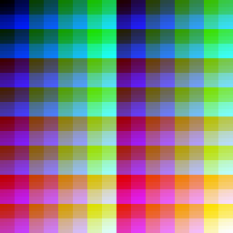

GCxxx hardware
===============

Major optional blocks: each of these can be present or not depending on the specific chip:

- 2D engine
- Composition engine
- 3D engine
- VG engine

Some SoCs have multiple GPU cores, and have distributed the blocks mentioned above over the cores (I suppose
for extra parallelism and/or granularity in power switching). For example the Marvell Armada 620 has a GC2000
with only the 3D engine as well as a GC300 with only the 2D engine. Similarly, the Freescale i.mx6 SoC has a
GC2000 with the 3D engine, a GC320 with 2D engine and a GC355 with VG engine.

- State space is a 256kB (65536 times uint32) register file divided up into
  separate units for parts of the chip (such as PE, RS, ...)

- Most of the state is latched; that means if it's set to a certain value, it
  will keep that value until the next change

- Instead of programming the registers directly (which is possible from kernel
  space), the FE, a DMA engine, is used to queue state changes for later

- To perform an operation such as rendering, all the state for doing that
  operation have been programmed to the desired values

Feature bits
=================

Which features are supported on a certain Vivante core is not only determined by the model number
(which AFAIK mainly determines the performance), but specified by a combination of factors:

 1) Chip features and minor feature flags
 2) Chip specs (number of instructions, pipelines, ...)
 3) Chip model (GC800, GC2000, ...)
 4) Chip revision of the form 0x1234

All of these are available in read-only registers on the hardware. On most cases it suffices to check the feature flags as
Unlike NV, which parametrizes everything on the model and revision, for GC this is left for bugfixes (even these sometimes
have their own feature bit).

For an overview of the feature bits see the enumerations in `state.xml`.

For the Vivante GPUs on some platforms the detailed features and specs are known, these can be found in `doc/gpus_comparison.html`
(`tools/data/gpus.json` for the raw source data).

Modules
==============
(from Vivante SoCIP 2011 presentation [1])

            ------------------
            | Host Interface |
            ------------------
                    |
         ----------------------
         |  Memory controller |
         ----------------------
          |         |    |    |
          |        \/   \|    |
          |       ---- -----  |
          |       |3D| |Tex|  ----
         \/         Shader--->|  |
       ----        ----       |PE|
       |FE|------->|DE|------>|  |
       ----        ----       ----

Functional blocks, indicated by two-letter abbreviations:

- FE Graphics Pipeline Front End (also: DMA engine, Fetch Engine)
- PE Pixel Engine (can be version 1.0 / 2.0)
- SH SHader (vertex + pixel)
- PA Primitive Assembly (clipping, perspective division, viewport transformation)
- SE Setup Engine (depth offset, scissor, clipping)
- RA RAsterizer (multisampling, clipping, culling, varying interpolation, generate fragments)
- TX Texture
- VG Vector Graphics
- IM ? (unknown bit in idle state, may group a few other modules, or maybe the 2D DE)
- FP Fragment Processor?
- MC Memory Controller
- HI Host Interface
- DE 2D drawing and scaling engine
- RS Resolve (resolves rendered image to memory, this is a copy and fill engine)
  - VR Video raster (YUV tiler)
  - TS Tile Status

These abbreviations are used in `state.xml` for the stripes where appropriate.

[1] http://www.socip.org/socip/speech/pdf/2-Vivante-SoCIP%202011%20Presentation.pdf

Operations
-----------

Modules are programmed and kicked off using state updates, queued through the FE. An exception is 2D and 3D primitive rendering,
which is kicked off directly through a FE command.

The GC320 technical manual [1] describes quite a few operations, but only for the 2D part (DE).

Hands-on Workshop: Graphics Development on the i.MX 6 Series [2] has some tips specific to programming Vivante 3D hardware,
including OpenCL, but is very high level.

Thread walker = Rectangle walker? (seems to have to do with OpenCL)

[1] http://www.vivantecorp.com/Vivante_GC320_Technical_Reference_Manual_V1.0_A.pdf
[2] http://2012ftf.ccidnet.com/pdf/0049.pdf

Connections
-------------
Connections between the different modules follow the OpenGL pipeline design [3].

- FE2VS (FE-VS) fetch engine to vertex shader: attributes
- RA2SH (RA-PS) rasterizer to shader engine: varyings
- SH2PE (PS-PE) shader to pixel engine: color output

Overall:

    FE -> VS -> PA -> SE -> RA -> PS -> PE -> RS

See also [1]

- PA assembles 3D primitives from vertices, culls based on trivial rejection and clips based on near Z-plane
- PA transforms from 3D view frustum into 2D screen space
- SE determines rasterization starting point for each primitive, and also culls based on trivial rejection
- RA performs per-tile, per-subtile, per-quad and per-pixel clipping

  [1] METHOD FOR DISTRIBUTED CLIPPING OUTSIDE OF VIEW VOLUME
    http://www.freepatentsonline.com/y2010/0271370.html
  [2] Efficient tile-based rasterization
    http://www.google.com/patents/US8009169
  [3] OpenGL ES2 pipeline structure
    http://www.khronos.org/opengles/2_X/

Command stream
-------------------

Commands and data are sent to the GPU through the FE (Front End interface). The
command stream of the front-end interface has a specific format described in this section.

Overall format

    OOOOOxxx xxxxxxxx xxxxxxxx xxxxxxxx  Command (O=Opcode, x=argument)
    arg0
    ..
    argN-1

Opcodes

    00001 Update state
    00010 End
    00011 NOP
    00100 Start DE ([15-8] rect count, 1 parameter 0xDEADDEED 2 parameter words describing target rect)
    00101 Draw primitives
    00110 Draw indexed primitives
    00111 Wait ([15-0] count)
    01000 Link ([15-0] number of bytes, arg address)
    01001 Stall (argument seems same format as state 0380C)
    01010 Call
    01011 Return
    01101 Chip select

Arguments are always padded to 2 32-bit words. Number of argument words depends on the opcode, and
sometimes on the first word of the command.

See `cmdstream.xml` for detailed overview of commands and arguments. The most commonly used command is
`LOAD_STATE` whose header word has the following format:

    00001FCC CCCCCCCC AAAAAAAA AAAAAAAA  Update state

      F    Fixed point flag: convert a 16.16 fixed point float in the command stream to a floating point value in the state.
      C    Count of state words that follow
      A    Base address / 4

Synchronization
----------------
There are various states related to synchronization, either between different modules in the GPU
and the GPU and the CPU (through the FE).

- State `GL.SEMAPHORE_TOKEN`
- State `GL.STALL_TOKEN`
- The `STALL` command in command stream

The following sequence of states is common:

    GL.SEMAPHORE_TOKEN := FROM=RA,TO=PE
    GL.STALL_TOKEN := FROM=RA,TO=PE

The first state load arms the semaphore, the second one stalls the FROM module until the TO module has raised its semaphore. In
this example it stalls the rasterizer until the pixel engine has completed the commands up until now.

The `STALL` command is used to stall the command queue until the semaphore has been received. The stall command has
one argument that has the same format as the `_TOKEN` states above, except that the FROM module is always the FE.

Within the 3D engine, not many explicit synchronization points appear to be needed. Some exceptions:

- The blob issues a semaphore and stall from RA to PE when

  - Changing depth configuration in PE
  - Sometimes when changing stencil config in PE

- The blob issues a just a semaphore from RA to PE, and a stall before drawing a primitive when

  - Tile status address/configuration changes
  - Clearing depth
  - Clearing tile status

- The blob issues a semaphor and stall from FE to PE before changing the pipe from 2D to 3D or vice versa

XXX (cwabbott) usually, isa's have some sort of texture barrier or sync operation to be able to load textures asyncronously
(mali does it w/ pipeline registers) i'm wondering where that is in the vivante isa

Resolve
-----------
The resolve module is a copy and fill engine. It can copy blocks of pixels from one GPU address to another,
optionally tiling/detiling, converting between pixel formats, or scaling down by a factor of 2. The source and
destination address can be the same to fill in tiles that were not touched during the rendering process
(according to the Tile Status, see below) with the background color.

The RS and PE (drawing) share one set of pixel pipes. They will never be active concurrently (AFAIK).
They do however have separate caches, so before using RS to copy from a surface at least the COLOR cache needs to be flushed
(and possibly the RS cache). The blob also flushes the DEPTH cache, I do however not know why.

Tiled or supertiled resolve operation sizes need to be aligned to 16 horizontally and 4 vertically.

Non-tiled to non-tiled:
    - need a width of at least 17 (I suppose the safe value is 32)
    - height must be multiple of 4

Tiled to non-tiled:
    - width must be at least 13 (I suppose the safe value is 16)
    - height must be at least 1

Tile status (Fast clear)
-------------------------
A render target is divided in tiles, and every tile has a couple of status flags.

An auxilary buffer associated with each render surface keeps track of these tile status flags, allocated with `gcvSURF_TILE_STATUS`.

One of these flags is the `clear` flag, that signifies that the tile has been cleared.
`fast clear` happens by setting the clear bit for each tile instead of clearing the actual surface
data.

Tile size is dependent on the hardware, and so is the number of bits per tile (can be two or four).

The tile status bits are cleared using RS, by clearing a small surface with the value
0x55555555. When clearing, only the destination address and stride needs to be set,
the source is ignored.

An invalid pattern in the tile status memory can result in hangs when rendering. This was discovered
in tests that used a depth surface but did not clear it. The residual data in the TS are caused
the GPU to hang mysteriously on rendering.

Shader ISA
================

Vivante GPUs have a unified shader ISA, this means that vertex and pixel shaders share the same
instruction set. See `isa.xml` and `isa.md` for details of the instructions, this section only provides a high-level overview.

- Each instruction consists of 4 32-bit words. These have a fixed format, with bitfields
that have a meaning which differs only very little per opcode. Which of these fields is used (which operands) does differ per opcode.

- Four-component SIMD processor (for most of the instructions)

- Older GPUs have floating point operations only, the newer ones have support for integer operations in the context of OpenCL.
  The split is around GC1000, though this being Vivante there is likely some feature bit for it.

- Instructions can have up to three source operands (`SRC0_*`, `SRC1_*`, `SRC2_*`), and one destination operand (`DST_`).
   In addition to that, there is a specific operand for texture sampling (`TEX_*`).

- Operands can have these properties:
  - `USE`: the operand is enabled (1) or not (0)
  - `REG`: register number to read or write
  - `SWIZ`: arbitrary swizzle from four to four components (source operands only)
  - `COMPS`: which components to affect (destination operand only)
  - `AMODE`: addressing mode; this can either be direct or indexed through the X,Y,Z,W component of the address register
  - `RGROUP`: choses the register group to read from (source operands only). Register groups are the temporaries, uniforms, and
     possibly others.

- Registers:
  - `N` four-component float temporary registers `tX` (actual number depends on the hardware, maximum seems to be 64 for all
      vivante GPUs I've encountered up until now), but like with other GPUs using more registers will likely restrict
      the available paralellism)
  - `1` four-component address register `a0`

Temporary registers are also used for shader inputs (attributes, varyings) and outputs (colors, positions). They are set to
the input values before the shader executes, and should have the output values when the shader ends. If the output
should be the same as the input (passthrough) an empty shader with only a NOP instruction can be used.

Rendering to framebuffer
=========================

Rendering to the framebuffer is pretty easy (see `etna_fb.c`). The general idea is to get the physical address
of the framebuffer using the `FBIOGET_VSCREENINFO` and `FBIOGET_FSCREENINFO` ioctls on the framebuffer device.
This physical address can then directly be used as target address for a resolve operation, just like when copying
to a normal bitmap.

Even though it would save a resolve operation it is not useful to use the physical address of the frame buffer
directly for rendering, as it only possible to render to tiled and supertiled surfaces, and (afaik) no display controller
supports scan out from tiled formats.

In many cases there is more framebuffer memory than that which is used for the current screen, which causes larger virtual resolution
to be returned than the physical resolution. Double-buffering is achieved by changing the y-offset within that virtual frame buffer.

Operations
========================
An attempt to figure out which operations can be triggered in the hardware, and what state is used to specify
their operation.

- RS: Kick off resolve by writing a value with bit 0 set to `RS_KICKER`. State used:
  - `RS_*`
  - `TS_*` (only when reading, if fast clear enabled through `TS_CONFIG`)

- FE: Kick off 3D rendering by sending command `DRAW_PRIMITIVES` / `DRAW_INDEXED_PRIMITIVES`
  - `FE_*` (vertex element layout, vertex streams, index stream, ...)
  - `GL_*` (varyings setup, multisampling)
  - `TS_*` (to read and update fast clear status for tiles)
  - `PA_*` primitive assembly
  - `SE_*` setup engine
  - `RA_*` rasterizer
  - `PE_*` pixel engine
  - `VS_*` vertex shader code + uniforms + linking information
  - `PS_*` pixel shader code + uniforms + linking information
  - `(N)TE_*` texture samplers
  - `SH_*` extra shader code + uniforms

- DE: Kick off 2D rendering by sending command `DRAW_2D`
  - `DE_*` 2D state
  - `FE_*` `GL_*` possibly

That's all, folks.

Programming pecularities
=========================

- The FE can convert from 16.16 fixed point format to 32 bit float. This is enabled by the `fixp` bit
  in the `LOAD_STATE` command. This is mostly useful for older ARM CPUs without native floating point
  support. The blob driver uses it for some states (viewport scaling, offset, scissor, ...)
  but not others (uniforms etc).

- It is quite easy to hang the GPU when making a minor programming mistake.
  When the GPU is stuck it is possible to submit command buffers, however nothing gets drawn and nothing
  ever finishes.

  Ways I've already made it crash:

  - Wrong number of VS inputs (must be equal to number of vertex elements)
  - Wrong number of temporaries in PS
  - Sending 3D commands in the 2D pipe instead of 3D pipe (then using a signal waiting for them to complete)
  - Wrong length of shader
  - Texture sampling without properly setup texture units
  - `SE_SCISSOR`: setting SCISSOR bottom/right to `(x<<16)|5` instead of `(x<<16)-1` causes crashes for higher resolutions
    such as 1920x1080 on GC600. I don't know why, maybe some buffer or cache overflow. The rockchip vivante driver always uses |5 AFAIK,
    this offset appears to be different per specific chip/revision.

  This may be a (kernel) driver problem. It is possible to reset the GPU from user space with an ioctl, but
  this usually is not enough to make it un-stuck. It would probably be a better solution to introduce a kernel-based timeout
  instead of relying on userspace to be 100% correct (may exist on v4?).

Masked state
-------------

Many groups of state bits, especially in the PE, have a mask bit. These have been named `*_MASK`.
When the mask bit belonging to a group of state bits is *set* on a state write, the accompanying
state bits will be unaffected. If the mask bit is *unset*, the state bits will be written.

This allows setting state per group of bits. For example, it allows setting only
the destination alpha function (`ALPHA_CONFIG.DST_FUNC_ALPHA`) without affecting the
other bits in that state word.

If masking functionality is not desired, simply keep all the `_MASK` bits at zero and write all
bits at once. This is what I used in `etna_pipe`, as I keep track of all state myself.

Texture tiling
----------------
RGBA/RGBx textures and render targets are stored in a 4x4 tiled format.

    Tile 1        Tile 2       ... Tile w-1
    0  1  2  3    16 17 18 19
    4  5  6  7    20 21 22 23
    8  9  10 11   24 25 26 27
    12 13 14 15   28 29 30 31

The stride of these tiled surfaces is the number of bytes between one row of tiles and the next. So for a surface of width
512, it is `(512/4)*16*4=8192`.

Supertiling
-------------------

It appears that the blob always pads render buffers pixel sizes to a multiple of 64, ie, a width of 400 becomes 448 and 800 becomes 832.
This is because the render buffer is also tiled, albeit differently than the 4x4 tiling format of the textures.
On a fine level, every tile is the same as for normal tiled surfaces:

     0  1  2  3
     4  5  6  7
     8  9 10 11
    12 13 14 15

However, as the name 'supertiled' implies, the tiles themselves are also tiled, to be specific in this pattern:

    000 001  008 009  016 017  024 025  032 033  040 041  048 049  056 057
    002 003  010 011  018 019  026 027  034 035  042 043  050 051  058 059
    004 005  012 013  020 021  028 029  036 037  044 045  052 053  060 061
    006 007  014 015  022 023  030 031  038 039  046 047  054 055  062 063

    064 065  072 073  080 081  088 089  096 097  104 105  112 113  120 121
    066 067  074 075  082 083  090 091  098 099  106 107  114 115  122 123
    068 069  076 077  084 085  092 093  100 101  108 109  116 117  124 125
    070 071  078 079  086 087  094 095  102 103  110 111  118 119  126 127

    128 129  136 137  144 145  152 153  160 161  168 169  176 177  184 185
    130 131  138 139  146 147  154 155  162 163  170 171  178 179  186 187
    132 133  140 141  148 149  156 157  164 165  172 173  180 181  188 189
    134 135  142 143  150 151  158 159  166 167  174 175  182 183  190 191

    192 193  200 201  208 209  216 217  224 225  232 233  240 241  248 249
    194 195  202 203  210 211  218 219  226 227  234 235  242 243  250 251
    196 197  204 205  212 213  220 221  228 229  236 237  244 245  252 253
    198 199  206 207  214 215  222 223  230 231  238 239  246 247  254 255

This has some similarity to a http://en.wikipedia.org/wiki/Z-order_curve or other space-filling curve,
but is only nested one level, in total this results in 64x64 sized tiles.

The GPU can render to normal tiled surfaces (such as used by textures) as well as supertiled surfaces. However,
rendering to supertiled surfaces is likely faster due to better cache locality.

Stride, as used for resolve operations, is for a row of tiles not a row of pixels; 0x1c00 for width 448 (originally 400),
0x3400 for width 832 (originally 800).

Multisampling
--------------

GC600 supports 1, 2, or 4 MSAA samples. Vivante's patent [1] on anti-aliasing may reveal some of the inner workings.

- 256x256 target with 1 sample creates a 256x256 render target (duh)

        GL.MULTI_SAMPLE_CONFIG := MSAA_SAMPLES=NONE,MSAA_ENABLES=0xf,UNK12=0x0,UNK16=0x0
        PE.COLOR_STRIDE := 0x400
        PE.DEPTH_STRIDE := 0x200

- 256x256 target with 2 samples creates a 512x256 render target and depth buffer

        GL.MULTI_SAMPLE_CONFIG := MSAA_SAMPLES=2X,MSAA_ENABLES=0x3,UNK12=0x0,UNK16=0x0
        RA.MULTISAMPLE_UNK00E04 := 0x0
        RA.MULTISAMPLE_UNK00E10[0] := 0xaa22
        RA.CENTROID_TABLE[0] := 0x66aa2288
        RA.CENTROID_TABLE[1] := 0x88558800
        RA.CENTROID_TABLE[2] := 0x88881100
        RA.CENTROID_TABLE[3] := 0x33888800
        PE.COLOR_STRIDE := 0x800  (doubled)
        PE.DEPTH_STRIDE := 0x400  (doubled)

- 256x256 target with 4 samples creates a 512x512 render target and depth buffer

        GL.MULTI_SAMPLE_CONFIG := MSAA_SAMPLES=4X,MSAA_ENABLES=0xf,UNK12=0x0,UNK16=0x0
        RA.MULTISAMPLE_UNK00E04 := 0x0
        RA.MULTISAMPLE_UNK00E10[2] := 0xaaa22a22
        RA.CENTROID_TABLE[8] := 0x262a2288
        RA.CENTROID_TABLE[9] := 0x886688a2
        RA.CENTROID_TABLE[10] := 0x888866aa
        RA.CENTROID_TABLE[11] := 0x668888a6
        RA.MULTISAMPLE_UNK00E10[1] := 0xe6ae622a
        RA.CENTROID_TABLE[4] := 0x46622a88
        RA.CENTROID_TABLE[5] := 0x888888ae
        RA.CENTROID_TABLE[6] := 0x888888e6
        RA.CENTROID_TABLE[7] := 0x888888ca
        RA.MULTISAMPLE_UNK00E10[0] := 0xeaa26e26
        RA.CENTROID_TABLE[0] := 0x4a6e2688
        RA.CENTROID_TABLE[1] := 0x888888a2
        RA.CENTROID_TABLE[2] := 0x888888ea
        RA.CENTROID_TABLE[3] := 0x888888c6
        PE.COLOR_STRIDE := 0x800
        PE.DEPTH_STRIDE := 0x400  (doubled)

Other differences when MSAA is enabled:

- `TS.MEM_CONFIG` is different when MSAA is used (see descriptions for fields `MSAA` and `MSAA_FORMAT`).
- The TS surface belonging to the enlarged in the same way; it is treated as if there simply is a bigger render target.
- It also looks like the PS gets an extra input/temporary when MSAA is enabled:

        -0x00001f02, /*   PS.INPUT_COUNT := COUNT=2,COUNT2=31 */
        +0x00001f03, /*   PS.INPUT_COUNT := COUNT=3,COUNT2=31 */
        -0x00000002, /*   PS.TEMP_REGISTER_CONTROL := NUM_TEMPS=2 */
        +0x00000003, /*   PS.TEMP_REGISTER_CONTROL := NUM_TEMPS=3 */

Haven't yet checked what the value is that is passed in (XXX todo). The shader code itself is unaffected the same so the extra
input is added to the end.

- When resolving the supersampled surface to another (normal pixmap) surface, flag `SOURCE_MSAA` must be configured appropriately to
  un-subsample the surface. `WINDOW_SIZE` for this resolve is the *doubled* window size as above, so 512x512 for a 256x256 render
  target with MSAA.

[1] http://www.faqs.org/patents/app/20110249901

Rendering points
------------------
When rendering points (PRIMITIVE_TYPE_POINTS) there are some differences:

- VS can have an extra output, the size of the point `gl_pointSize`
  if `PA_CONFIG.POINT_SIZE_ENABLE` is set. This will be the last output in `VS_OUTPUT`.

- There is an extra varying for `gl_pointCoord` with two components. This varying has
  its components in `GL_VARYING_COMPONENT_USE` set to `POINTCOORD_X` and `POINTCOORD_Y`.
  Its `PA_SHADER_ATTRIBUTES` is set to `0x000002f1`.
  The VS output associated to this varying in `VS_OUTPUT` is discarded, so can be set
  to any output register.

- `rasterizer.point_size_per_vertex` affects number of vs outputs (just like MSAA!). If point
  size per vertex is not set, the value in `PA.POINT_SIZE` is used.

- Distinction between sprite coordinate origin `UPPER_LEFT` / `LOWER_LEFT` is implemented by adding
  a 1.0-y instruction when glPointCoord is used. XXX figure out what is the default.

Vertex texture fetch
--------------------

Vertex samplers live in the same space as fragment samplers. The blob uses a fixed mapping:
sampler 0..7 are used as fragment samplers and 8..11 are used as vertex samplers.

The shaders themselves refer to the absolute shader number; so tex8 is the first texture unit used in a
vertex shader. The normal TEX instruction can be used to sample textures from a vertex shader.

Vivante hw has two texture caches that need to be flushed separately, one for fragment shaders
one for vertex shaders (bits `GL.FLUSH_CACHE.TEXTURE` and `GL.FLUSH_CACHE.TEXTUREVS` respectively).

This solves a problem with running `cubemap_sphere` after `displacement` demo;
it seemed that some leftover cache from using a texture in displacement
caused the texture in `cubemap_sphere` (which is only 1x1x6) to be messed
up (due to containing old values).

Warning: setting the `TEXTUREVS` bit seems to result in crashes when rendering directly afterwards.
Even adding a PE to FE semaphore afterwards or dummy state loads does not fix this. It could be that
a RA to PE (or FE) semaphore *before* the flush solves this crash. A similar issue exists when flushing
the TS cache.

All texture filtering options are allowed for vertex texture fetch.

XXX maybe figure out if the sampler units are shared between fragment and vertex shaders and thus interchangeable. This is
  not important for GL/Gallium because it already lives with the assumption that vertex and fragment shaders
  are distinct.

Shader size on GC2000
----------------------

The "query chip identity" ioctl on GC2000 reports an instructionCount of 512. Looking at the low-level command
stream dumps the device appears to have 0x0E000 - 0x0C000 = 8192 bytes of instruction memory, with 128 bit
instructions this indeed maps to 512 instructions.

XXX does the VS/PS split at instruction 256 during rendering affect OpenCL? Hopefully not...

State changes and caches
--------------------------

It looks like some state changes invalidate the cache. Before these state changes it is important to flush
the appropriate cache so that the rendered cache tiles are properly written back. These are at least:

    PE.COLOR_FORMAT.OVERWRITE -> flush COLOR

(others will be added when found)

- before flushing the TS cache (as before a clear) first make sure that DEPTH
  and COLOR are flushed, and a stall from RA to PE is done, otherwise a crash will happen.

Memory alignment
-----------------

We should take this errata into account moving down the road with GPU drivers.  
The GPU3D L1 cache assumes that all memory requests are 16 bytes. If a request is 16 bytes, there
are no issues since the data boundary lines up evenly. If a request is not aligned to 16 bytes, the
memory controller will split those unaligned requests into two requests, doubling the number of
requests processed internally in L1 cache.
(jnettlet)

